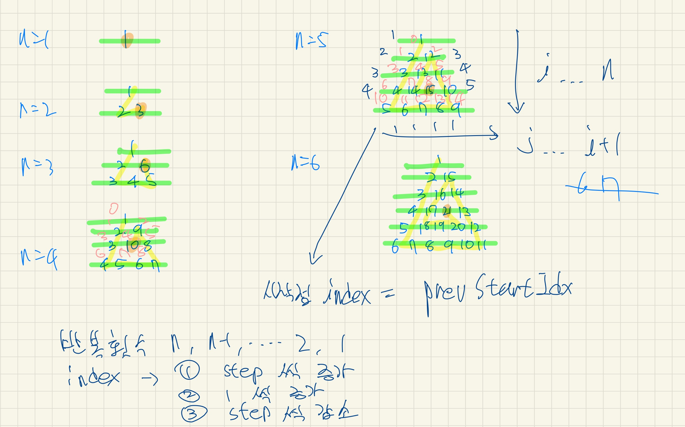

# [삼각 달팽이](https://programmers.co.kr/learn/courses/30/lessons/68645)

## My Solution 1

> 2022/02/05



```java
import java.util.Arrays;

// 값은 1씩 증가하면서 인덱스를 조정해서 해당 값을 알맞은 자리에 넣는다.
// 왼쪽 변을 지날 떄는 인덱스가 step (step 은 1씩 증가) 씩 증가하고
// 오른쪽 변을 지날 때는 인덱스가 step (step은 1씩 감소) 씩 감소하고
// 밑변을 지날때는 1씩 증가한다.
// 이렇게 다음 인덱스를 얻는 것은 왼쪽, 밑, 오른쪽 변에따라 3가지 이다.
class Solution {
    private int idxStep = 0;
    private int idx = 0;
    // 한 변을 지날 떄마다 아래 변수 값이 증가한다.
    // 이를 통해서 다음 인덱스를 얻는 전략을 설정할 수 있다.
    private int loopLevel = 0;

    public int[] solution(int n) {
        int total = n * (n + 1) / 2;
        int[] answer = new int[total];

        int curVal = 1;
        while (curVal <= total) {
            for (int i = 0; i < n - loopLevel; i++) {
                int curIdx = nextIdx();
                answer[curIdx] = curVal++;
            }
            loopLevel++;
        }

        return answer;
    }

    public int nextIdx() {
        if (loopLevel % 3 == 0) {
            idx += idxStep;
            idxStep++;
        } else if (loopLevel % 3 == 1) {
            idx++;
        } else if (loopLevel % 3 == 2) {
            idx -= idxStep;
            idxStep--;
        }

        return idx;
    }
}
```

## Study 1

> 2022/02/06

> 프로그래머스 다른 사람 풀이 참조

```java
class Solution {
    public int[] solution(int n) {
        int[] answer = new int[(n*(n+1))/2];
        int[][] matrix = new int[n][n];

        int x = -1, y = 0;
        int num = 1;

        for (int i = 0; i < n; ++i) {
            for (int j = i; j < n; ++j) {
                if (i % 3 == 0) {
                    ++x;
                } else if (i % 3 == 1) {
                    ++y;
                } else if (i % 3 == 2) {
                    --x;
                    --y;
                }
                matrix[x][y] = num++;
            }
        }

        int k = 0;
        for(int i = 0; i < n; ++i) {
            for(int j = 0; j < n; ++j) {
                if(matrix[i][j] == 0) break;
                answer[k++] = matrix[i][j];
            }
        }

        return answer;
    }
}
```

- 나는 삼각형 모양을 문제에서 주어진 그대로 정삼각형 모양을 생각하며 접근
- 1차원 배열에 그대로 결과값을 도출해내려 했다.
- 위 풀이는 여분의 메모리를 추가적으로 사용하기는 하지만
- 삼각형 모양을 조금 더 유연하게 문제와 같이 생각하지 않았고 더 쉽게 풀이할 수 있게 하였다.
- 위 `matrix` 이차원 배열을 n * n 사이즈가 아니라 n 개의 행에 각 행의 배열 길이를 유동적으로 설정하면 저장 공간의 낭비도 줄일 수 있을 것

### 위 코드 개선

```java
import java.util.*;

class Solution {
    public int[] solution(int n) {
        int[] answer = new int[(n*(n+1))/2];
        int[][] matrix = new int[n][];
        for (int i = 0; i < n; i++) {
            matrix[i] = new int[i + 1];
        }

        int y = -1, x = 0;
        int num = 1;

        for (int i = 0; i < n; i++) {
            for (int j = 0; j < n - i; j++) {
                if (i % 3 == 0) {
                    ++y;
                } else if (i % 3 == 1) {
                    ++x;
                } else if (i % 3 == 2) {
                    --x;
                    --y;
                }
                matrix[y][x] = num++;
            }
        }

        int k = 0;
        for(int i = 0; i < matrix.length; ++i) {
            for(int j = 0; j < matrix[i].length; ++j) {
                answer[k++] = matrix[i][j];
            }
        }

        return answer;
    }
}
```
